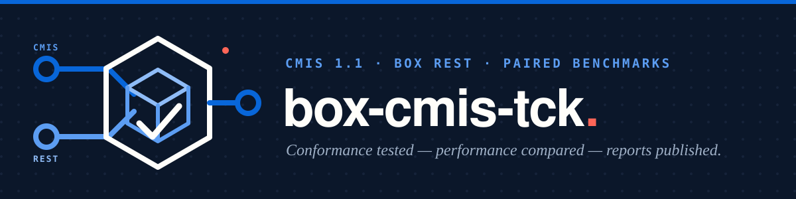

# Box CMIS Technology Compatibility Kit

[](LICENSE)


A fast, Box-aware compatibility test kit for CMIS 1.1 Browser Binding services.

This project validates the [Box CMIS connector](https://github.com/unofficialbox/box-cmis-connector) against behavior derived from Apache Chemistry OpenCMIS. Live tests exercise equivalent CMIS and native Box REST operations, compare responses and elapsed times, and produce portable JSON, Markdown, CSV, and HTML reports.

It complements the upstream OpenCMIS TCK; it does not replace it.

> **Not affiliated with, authorized, or endorsed by Box, Inc.** "Box" is a
> trademark of Box, Inc. This is an independent community compatibility suite.

## What it provides

- Bounded fixtures inside a dedicated Box folder.
- Strict pass/fail detection, including failures OpenCMIS may only print in logs.
- Explicit coverage of unsupported CMIS capabilities.
- Side-by-side CMIS and Box REST response and performance measurements.
- Client, connector retry, and relationship-stage telemetry.
- Repeated benchmark aggregation using median and p95 statistics.
- Automatic upload of completed live reports to the Box folder under test.

Coverage includes object operations, queries, content changes, operation-context behavior, and bounded stress cases. See the [OpenCMIS parity map](open-cmis-parity.md) for the test-by-test mapping.

## Requirements

- [Bun](https://bun.sh/) 1.3.11 or later
- Node.js 22 or later
- A running Box CMIS Browser Binding connector
- Box credentials accepted by the connector
- A dedicated, disposable Box folder for live fixtures

The connector and repository defaults are `http://127.0.0.1:8080/cmis` and `box`.

## Quick start

### 1. Install and run the safe local checks

```bash
git clone https://github.com/unofficialbox/box-cmis-tck.git
cd box-cmis-tck
bun install --frozen-lockfile
bun test tests/tck
```

Without live opt-ins, this command runs the local harness and skips tests that read or modify Box content.

### 2. Start the connector

Run the connector in another terminal. If both repositories are sibling checkouts:

```bash
cd ../box-cmis-connector
bun install --frozen-lockfile
bun run start
```

Follow the connector README to configure its Box application and authentication.

### 3. Configure an isolated test folder

Create an empty Box folder for TCK fixtures and copy its numeric folder id from the Box URL. Do not use the enterprise root (`0`) or a folder containing production content.

When using the sibling connector's `.env`:

```bash
set -a
source ../box-cmis-connector/.env
set +a

export BOX_CMIS_TCK_RUN_ROOT_ID=YOUR_RUN_FOLDER_ID
export BOX_CMIS_TCK_ALLOW_DESTRUCTIVE=true
```

Raw Box REST comparisons use either the connector's Client Credentials Grant variables or an explicit `BOX_CMIS_TCK_BOX_ACCESS_TOKEN`. The Box application must be able to access the isolated folder.

### 4. Run the live suite

```bash
bun test tests/tck
```

The suite writes reports under `tests/tck/reports/` and uploads completed live artifacts to `BOX_CMIS_TCK_RUN_ROOT_ID`. Credentials and request bodies are never written to reports.

## Run a paired benchmark

```bash
export BOX_CMIS_TCK_BENCHMARK_RUNS=10
bun run benchmark:paired
```

The runner repeats the paired Phase 2 and Phase 3 tests, aggregates the results, generates a self-contained HTML report, and uploads the batch artifacts to the test folder. The repetition count accepts values from 2 through 20 and defaults to 3.

## Reports

Live and repeated runs can produce:

- raw per-test JSON results;
- aggregate JSON, Markdown, and CSV comparisons;
- a self-contained HTML report; and
- optional cross-window performance evaluations.

Reports include outcomes, cleanup status, elapsed time, median and p95 distributions, CMIS-to-Box ratios, retry attribution, and connector relationship-stage timings when available.

## Documentation

- [Advanced usage](docs/advanced-usage.md): test modes, configuration, report tooling, benchmark evaluation, focused diagnostics, and troubleshooting.
- [OpenCMIS parity map](open-cmis-parity.md): optimized coverage mapped to upstream OpenCMIS tests.

## Safety

Live mutations require both an explicit opt-in and a run or parent folder id. Stress cases require a second opt-in. Fixtures are bounded, cleanup is recorded, and live reports upload to the folder used by the test.

Use only a dedicated, disposable Box folder.

## Contributing

Keep fixtures bounded, map new coverage to OpenCMIS behavior, protect live mutations with the appropriate guard, record cleanup, and update the parity map.

```bash
bun install --frozen-lockfile
bun test tests/tck
```

## License

Licensed under the [MIT License](LICENSE).
